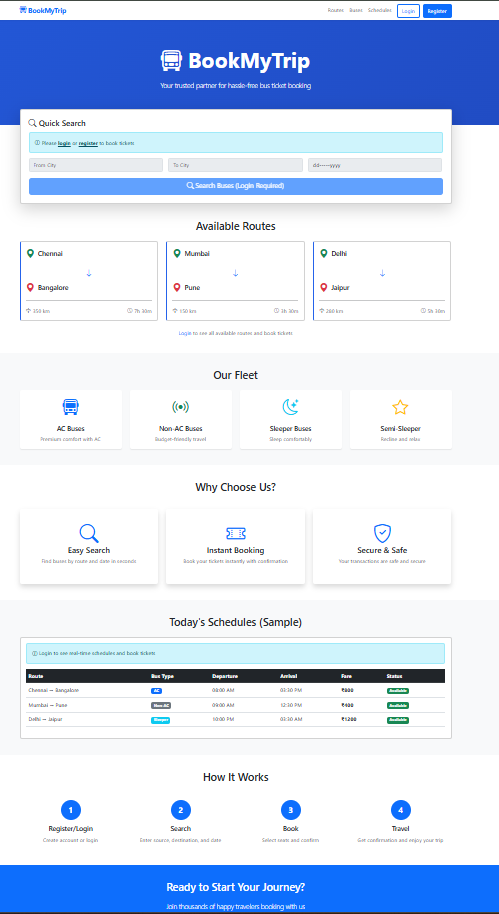
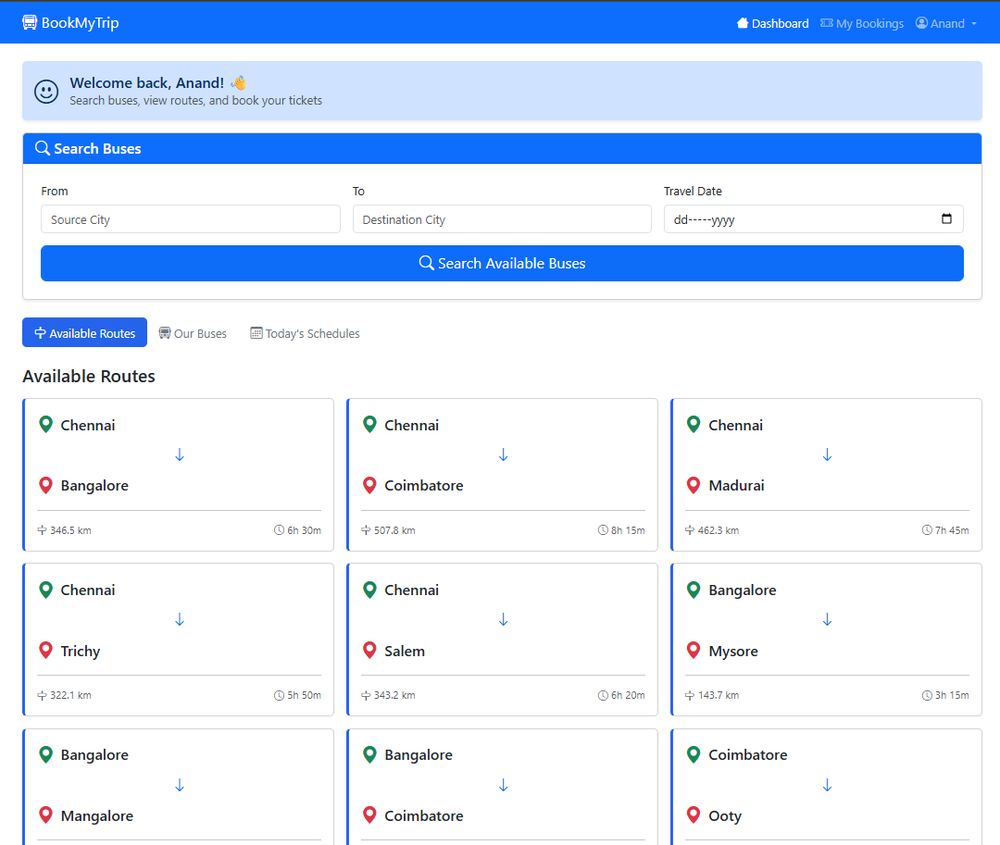
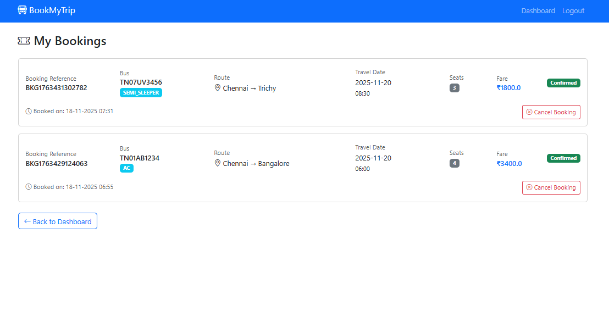
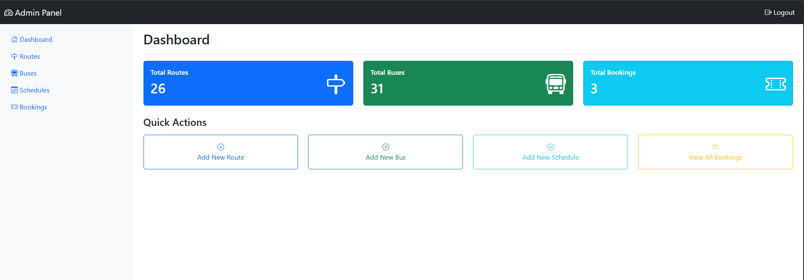

# 🚌 BookMyTrip - Bus Ticket Booking System

A full-stack web application for online bus ticket booking built with **Spring Boot** and **MySQL**.

[](https://www.oracle.com/java/)
[](https://spring.io/projects/spring-boot)
[](https://www.mysql.com/)
[](LICENSE)

## 📋 Overview

BookMyTrip is a comprehensive bus ticket booking platform that allows users to search buses, book tickets, and manage bookings online. Administrators can manage routes, buses, schedules, and view all bookings through a dedicated admin panel.

**Live Demo:** [Add your deployed link here if available]

---

## ✨ Key Features

### For Users

- 🔐 **Secure Authentication** - Register and login with encrypted passwords
- 🔍 **Smart Search** - Search buses by source, destination, and date
- 🎫 **Easy Booking** - Book tickets with real-time seat availability
- 📊 **Booking Management** - View booking history and cancel tickets
- 🚌 **Browse Options** - View all available routes, buses, and schedules

### For Admins

- 🛣️ **Route Management** - Add, edit, and delete bus routes
- 🚍 **Bus Management** - Manage bus fleet and assignments
- 📅 **Schedule Management** - Create and manage bus schedules
- 📈 **Dashboard** - View statistics and all bookings
- 👥 **User Overview** - Monitor all user activities

### Technical Highlights

- ✅ Role-based access control (USER/ADMIN)
- ✅ Real-time seat availability tracking
- ✅ Transaction management for booking consistency
- ✅ Input validation and error handling
- ✅ Responsive UI with Bootstrap 5
- ✅ RESTful API design patterns

---

## 🛠️ Technology Stack

| Layer          | Technology                          |
| -------------- | ----------------------------------- |
| **Backend**    | Java 17, Spring Boot 3.2            |
| **Security**   | Spring Security with BCrypt         |
| **Database**   | MySQL 8.0                           |
| **ORM**        | Spring Data JPA, Hibernate          |
| **Frontend**   | Thymeleaf, Bootstrap 5, HTML/CSS/JS |
| **Build Tool** | Maven                               |
| **Utilities**  | Lombok                              |

---

## 🏗️ Architecture

```
┌─────────────────────────────────────┐
│     Presentation Layer              │
│   (Controllers + Thymeleaf)         │
└─────────────────────────────────────┘
              ↓
┌─────────────────────────────────────┐
│      Business Logic Layer           │
│         (Services)                  │
└─────────────────────────────────────┘
              ↓
┌─────────────────────────────────────┐
│      Data Access Layer              │
│       (Repositories)                │
└─────────────────────────────────────┘
              ↓
┌─────────────────────────────────────┐
│         MySQL Database              │
└─────────────────────────────────────┘
```

**Design Patterns Used:**

- MVC (Model-View-Controller)
- DTO (Data Transfer Object)
- Repository Pattern
- Service Layer Pattern
- Dependency Injection

---

## 🗄️ Database Schema

**Entities:**

- **Users** - User information and credentials
- **Routes** - Bus routes with source/destination
- **Buses** - Bus details and assignments
- **Schedules** - Trip schedules with timing and fare
- **Bookings** - User ticket bookings

**Relationships:**

- One User → Many Bookings
- One Route → Many Buses
- One Bus → Many Schedules
- One Schedule → Many Bookings

---

## 🚀 Getting Started

### Prerequisites

- Java 17 or higher
- Maven 3.6+
- MySQL 8.0+
- IDE (IntelliJ IDEA / Eclipse / VS Code)

### Installation Steps

1. **Clone the repository**

```bash
git clone https://github.com/YOUR-USERNAME/bookmytrip-bus-booking.git
cd bookmytrip-bus-booking
```

2. **Create MySQL database**

```sql
CREATE DATABASE bookmytrip_db;
```

3. **Configure database**

Edit `src/main/resources/application.properties`:

```properties
spring.datasource.url=jdbc:mysql://localhost:3306/bookmytrip_db
spring.datasource.username=YOUR_USERNAME
spring.datasource.password=YOUR_PASSWORD
```

4. **Build the project**

```bash
mvn clean install
```

5. **Run the application**

```bash
mvn spring-boot:run
```

6. **Access the application**

```
http://localhost:8080
```

### Default Credentials

**Admin Login:**

- Email: `admin@bookmytrip.com`
- Password: `admin123`

**User Login:**

- Register a new account or use test account

---

## 📸 Screenshots

### Home Page


_Landing page with available routes and schedules_

### User Dashboard


_User dashboard with search and booking options_

### Booking Process


_Ticket booking interface with seat selection_

### Admin Panel


_Admin dashboard for managing system_

> **Note:** Add screenshots to `/screenshots` folder in your repository

---

## 📁 Project Structure

```
bookmytrip/
├── src/
│   ├── main/
│   │   ├── java/com/bookmytrip/
│   │   │   ├── config/           # Security & app configuration
│   │   │   ├── controller/       # REST controllers
│   │   │   ├── dto/              # Data transfer objects
│   │   │   ├── exception/        # Custom exceptions
│   │   │   ├── model/            # JPA entities
│   │   │   ├── repository/       # Data repositories
│   │   │   └── service/          # Business logic
│   │   └── resources/
│   │       ├── templates/        # Thymeleaf templates
│   │       ├── static/           # CSS, JS, images
│   │       └── application.properties
│   └── test/                     # Unit tests
├── pom.xml                       # Maven dependencies
└── README.md
```

---

## 🧪 Testing

```bash
# Run all tests
mvn test

# Run with coverage
mvn clean test jacoco:report
```

---

## 🔒 Security Features

- ✅ BCrypt password encryption
- ✅ Role-based authorization (USER/ADMIN)
- ✅ CSRF protection
- ✅ Session management
- ✅ SQL injection prevention (JPA/Hibernate)
- ✅ Input validation and sanitization

---

## 🚧 Future Enhancements

- [ ] Online payment integration (Razorpay/Stripe)
- [ ] Interactive seat selection UI
- [ ] PDF ticket generation with QR code
- [ ] Email/SMS notifications
- [ ] Bus ratings and reviews
- [ ] Multi-language support
- [ ] Mobile application (Android/iOS)
- [ ] Advanced analytics dashboard

---

## 🤝 Contributing

Contributions are welcome! Please follow these steps:

1. Fork the repository
2. Create a feature branch (`git checkout -b feature/AmazingFeature`)
3. Commit changes (`git commit -m 'Add AmazingFeature'`)
4. Push to branch (`git push origin feature/AmazingFeature`)
5. Open a Pull Request

---

## 📝 License

This project is licensed under the MIT License - see the [LICENSE](LICENSE) file for details.

---

## 👨‍💻 Author

**Your Name**

- GitHub: [@your-username](https://github.com/your-username)
- LinkedIn: [Your LinkedIn](https://linkedin.com/in/your-profile)
- Email: your.email@example.com

---

## 🙏 Acknowledgments

- Spring Boot Documentation
- Baeldung Tutorials
- Stack Overflow Community
- Bootstrap Team

---

## 📞 Support

For support, email your.email@example.com or create an issue in this repository.

---

<div align="center">

**⭐ Star this repository if you find it helpful!**

Made with ❤️ using Spring Boot

</div>
```

---

## 🎯 Part 4: Additional Files to Add

### 1. Create LICENSE File

Create `LICENSE` file:

```
MIT License

Copyright (c) 2024 [Your Name]

Permission is hereby granted, free of charge, to any person obtaining a copy
of this software and associated documentation files (the "Software"), to deal
in the Software without restriction, including without limitation the rights
to use, copy, modify, merge, publish, distribute, sublicense, and/or sell
copies of the Software, and to permit persons to whom the Software is
furnished to do so, subject to the following conditions:

The above copyright notice and this permission notice shall be included in all
copies or substantial portions of the Software.

THE SOFTWARE IS PROVIDED "AS IS", WITHOUT WARRANTY OF ANY KIND, EXPRESS OR
IMPLIED, INCLUDING BUT NOT LIMITED TO THE WARRANTIES OF MERCHANTABILITY,
FITNESS FOR A PARTICULAR PURPOSE AND NONINFRINGEMENT. IN NO EVENT SHALL THE
AUTHORS OR COPYRIGHT HOLDERS BE LIABLE FOR ANY CLAIM, DAMAGES OR OTHER
LIABILITY, WHETHER IN AN ACTION OF CONTRACT, TORT OR OTHERWISE, ARISING FROM,
OUT OF OR IN CONNECTION WITH THE SOFTWARE OR THE USE OR OTHER DEALINGS IN THE
SOFTWARE.
```
